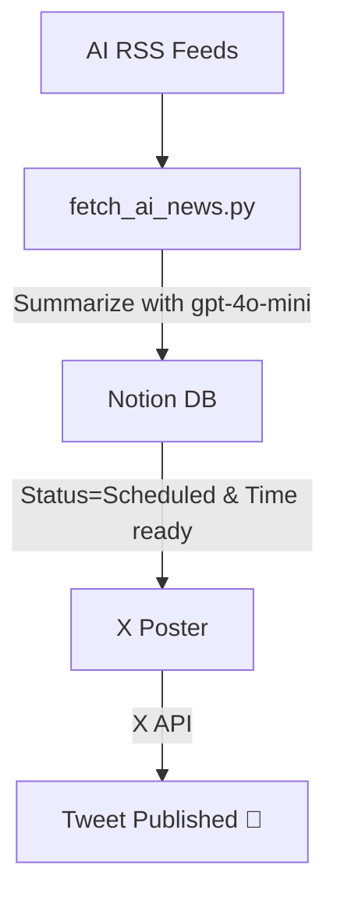

<h1 align="center">🧠 Notion-X Scheduler</h1>
<p align="center">
  <i>Daily AI news → summarized → queued in Notion → posted to X (Twitter) — fully automated.</i>
</p>

<p align="center">
  
  
  
  
  
  
</p>

---

## Overview

This repo automatically curates and posts AI news to X (Twitter) using an efficient two-stage pipeline:

1. **Fetcher** runs once daily at ~10:05 AM Europe/Paris time (DST-aware), parses 7 trusted AI RSS feeds, scores articles by relevance and recency, summarizes the top pick with OpenAI's `gpt-4o-mini`, and queues it in your Notion database with `Status=Scheduled`.

2. **Poster** runs at ~10:10 AM (5 minutes after fetcher) to publish queued content. Also triggers immediately when fetcher completes successfully via event-chaining for zero-delay posting.

**Built and maintained by:** @skalaliya

---

## Architecture



---

## Features

* 📰 **Multi-source AI feeds** (OpenAI, Google AI, DeepMind, NVIDIA, AWS ML, TechCrunch, VentureBeat)
* 🧠 **Smart summarization** with `gpt-4o-mini` (cost-effective, high-quality) — graceful fallback to heuristics
* 🗂️ **Notion as content queue** (`Status=Scheduled` + `Scheduled Time` properties)
* ⏰ **DST-aware scheduling**: Runs once daily at ~10:05 AM Paris time year-round (dual UTC crons)
* 🔁 **Event-chained workflows**: Poster auto-triggers after successful fetch for instant publishing
* 🛡️ **Pre-check validation**: Skips poster run if no ready posts exist (saves compute minutes)
* 🧪 **Dry-run mode**: Test with `--dry-run` flag or workflow dispatch for JSON output
* 🎯 **Relevance scoring**: Keyword matching + recency decay (48h window)
* 💰 **Compute-optimized**: ~45 minutes/month usage (2% of GitHub free tier)

---

## Quick Start

### 1. Setup Secrets

Navigate to **GitHub → Settings → Secrets → Actions** and add:

**Required:**
* `NOTION_TOKEN` - Your Notion integration token
* `NOTION_DB_ID` - Target database ID
* `ACCESS_TOKEN`, `ACCESS_TOKEN_SECRET` - X/Twitter OAuth tokens
* `API_KEY`, `API_KEY_SECRET` - X/Twitter API credentials

**Optional:**
* `OPENAI_API_KEY` - Enables AI summarization (without it, uses heuristic fallback)
* `OPENAI_MODEL` - Override model (default: `gpt-4o-mini`)

### 2. Test Locally (Dry Run)

```bash
python fetch_ai_news.py --dry-run
```

Expected output: JSON with top article details or "No fresh items (≤48h); Skipped."

### 3. Run in Production

**Option A: Manual trigger**
* Go to **Actions → AI Content Fetcher → Run workflow**
* Set `dry_run=false`
* Click **Run**

**Option B: Automatic schedule**
* Fetcher runs daily at ~10:05 AM Europe/Paris time
* Poster runs at ~10:10 AM (5 min buffer) or immediately after fetch completes

### 4. Monitor Execution

* **Fetcher**: Creates 1 `Status=Scheduled` row in Notion per run (if news found)
* **Poster**: Publishes scheduled posts and updates their status
* Check **Actions** tab for workflow logs and status

---

## How It Works

### Scheduling (DST-Aware & Compute-Optimized)

Both workflows use **dual UTC cron schedules** to maintain consistent Paris local time while minimizing compute usage:

**Fetcher Schedule:**
* **Mar–Oct (CEST, UTC+2)**: `5 8 * 3-10 *` → 08:05 UTC = 10:05 Paris
* **Nov–Feb (CET, UTC+1)**: `5 9 * 11,12,1,2 *` → 09:05 UTC = 10:05 Paris

**Poster Schedule:**
* **Mar–Oct (CEST, UTC+2)**: `10 8 * 3-10 *` → 08:10 UTC = 10:10 Paris
* **Nov–Feb (CET, UTC+1)**: `10 9 * 11,12,1,2 *` → 09:10 UTC = 10:10 Paris

The 5-minute gap ensures Notion writes complete before posting. GitHub Actions only supports UTC cron, so this dual-schedule approach automatically handles daylight saving transitions.

### Workflow Chain

```
Daily at 10:05 Paris
       ↓
[AI Content Fetcher]
       ↓ (writes to Notion)
       ↓ (5-min buffer)
[X Poster at 10:10] ← also triggers immediately on fetch success
       ↓
[check_ready_to_post.py validates Notion]
       ↓ (if posts ready)
[main.py publishes to X]
```

**Compute Efficiency:** Both workflows run once daily = ~2 runs/day = ~60 min/month (3% of free tier)

### Files

* **`fetch_ai_news.py`** (445 lines) - RSS parser, scorer, OpenAI integration, Notion writer
* **`main.py`** - X/Twitter poster with thread support
* **`check_ready_to_post.py`** - Pre-check validation script
* **`.github/workflows/fetch.yml`** - Fetcher workflow (daily at 10:05 Paris, DST-aware)
* **`.github/workflows/post.yml`** - Poster workflow (daily at 10:10 Paris + event-chained)

---

## Costs (typical)

| Service              | Monthly | Notes                          |
| -------------------- | ------: | ------------------------------ |
| GitHub Actions       | **Free** | ~60 min/month (3% of free tier) |
| OpenAI `gpt-4o-mini` |  <$0.01 | ~1 short summary/day           |
| Notion API           |    Free | Included in plan               |
| **Total**            | **<$0.01** | Virtually free to run       |

**Compute optimization:** Running once daily instead of hourly saves ~1,035 minutes/month (95% reduction)!

---

## Testing Matrix

* **LLM disabled:** Remove `OPENAI_API_KEY` → heuristic summaries activate automatically
* **Model override:** Set `OPENAI_MODEL` secret to test different models (e.g., `gpt-4`, `gpt-3.5-turbo`)
* **No news scenario:** Fetcher writes a "Skipped" row to Notion (production) or prints message (dry-run)
* **Manual dispatch:** Test anytime via Actions tab with `dry_run` toggle
* **Event-chain validation:** After manual fetch, verify poster auto-triggers within seconds

---

## Project Structure

```
notion-x-scheduler/
├── fetch_ai_news.py          # AI news fetcher (RSS → scoring → summarize → Notion)
├── main.py                   # X/Twitter poster (Notion → X API)
├── check_ready_to_post.py    # Pre-check validation for poster
├── requirements.txt          # Python dependencies
├── .github/workflows/
│   ├── fetch.yml            # Daily at 10:05 Paris (DST-aware)
│   └── post.yml             # Daily at 10:10 Paris + event-chained
└── README.md                # This file
```

---

## Contributing

PRs and issues welcome. If this helped, please ⭐ the repo:
**[https://github.com/skalaliya/notion-x-scheduler](https://github.com/skalaliya/notion-x-scheduler)**

---

## License

MIT
