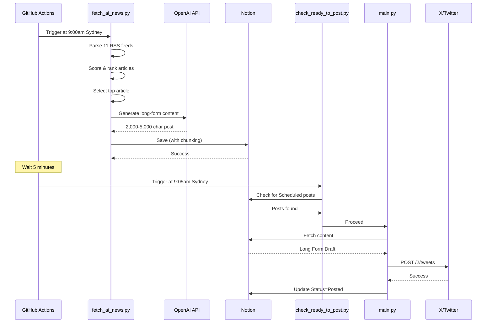

<h1 align="center">🤖 AI Content Scheduler</h1>
<p align="center">
  <strong>Automated Premium X/Twitter Content Pipeline</strong><br>
  <i>AI News → OpenAI Long-Form Generation → Notion Queue → X Premium Posts</i>
</p>

<p align="center">
  
  
  
  
  
  
  
</p>

---

## 🎯 What This Does

**Fully automated premium X/Twitter content system** that:
- 📡 Monitors **11 top AI news sources** (OpenAI, Google, Microsoft, NVIDIA, Hugging Face, etc.)
- 🧠 Uses **GPT-4o-mini** to generate engaging **2,000-5,000 character long-form posts**
- 🗂️ Stores drafts in **Notion** with smart duplicate detection
- 🚀 Auto-posts to **X/Twitter Premium** (supports up to 25,000 characters)
- ⏰ Runs **daily at 9:00am Sydney time** (fully automated via GitHub Actions)

**Perfect for:** AI enthusiasts, tech influencers, and anyone wanting to share curated AI insights without manual work!

**Built by:** [@skalaliya](https://github.com/skalaliya) | **License:** MIT

---

## 📊 System Architecture


```mermaid
graph LR
    A[🌐 11 AI RSS Feeds] --> B[📊 Score & Rank]
    B --> C[🎯 Select Top Article]
    C --> D[🤖 OpenAI GPT-4o-mini]
    D --> E[📝 2-5K Char Long-Form]
    E --> F[💾 Notion Database]
    F --> G[⏰ Wait 5 Minutes]
    G --> H[🚀 Post to X/Twitter]
    
    style A fill:#e3f2fd
    style D fill:#fff3e0
    style F fill:#f3e5f5
    style H fill:#e8f5e9
```

### 🔄 Daily Workflow (9:00am Sydney Time)

```
09:00:00  ┌─────────────────────────────────────┐
          │  🔍 Fetch AI News                   │
          │  • Parse 11 RSS feeds               │
          │  • Score by recency + keywords      │
          │  • Check for duplicates             │
          └─────────────────┬───────────────────┘
                           │
09:00:15  ┌─────────────────▼───────────────────┐
          │  🤖 Generate Long-Form Content      │
          │  • GPT-4o-mini enrichment           │
          │  • 2,000-5,000 character target     │
          │  • X-native plain text format       │
          └─────────────────┬───────────────────┘
                           │
09:00:30  ┌─────────────────▼───────────────────┐
          │  💾 Save to Notion                  │
          │  • Status: Scheduled                │
          │  • 2000-char chunking for API       │
          │  • Store in "Long Form Draft"       │
          └─────────────────┬───────────────────┘
                           │
09:05:00  ┌─────────────────▼───────────────────┐
          │  🚀 Post to X/Twitter               │
          │  • Read from Notion                 │
          │  • X API v2 (25k char support)      │
          │  • Update status to "Posted"        │
          └─────────────────────────────────────┘
```

---

## ✨ Key Features

### 🎯 Content Intelligence
- **11 Premium AI Sources:** OpenAI, Google AI Blog, Google Research, Microsoft Research, Microsoft AI, Hugging Face, Stability AI, NVIDIA, AWS ML, TechCrunch AI, VentureBeat AI
- **Smart Scoring Algorithm:** 
  - ⚡ Super fresh (<6h): +15 points
  - 🔥 Very fresh (6-12h): +12 points
  - ✅ Fresh (12-24h): +8 points
  - 📊 Keyword matching: +2 per keyword
  - 🎲 Source diversity penalties (prevents spam)
  - 🔍 Similarity detection (prevents duplicates)
- **48-Hour Window:** Only considers recent, relevant news

### 🤖 AI-Powered Content Generation
- **OpenAI GPT-4o-mini** for premium long-form posts
- **2,000-5,000 character target** (can go up to 25,000)
- **X-native formatting:** Plain text with proper spacing (NO markdown symbols)
- **Graceful fallback:** Uses heuristic summaries if OpenAI unavailable

### 🗂️ Notion Integration
- **Smart Database:** Title, Long Form Draft, Status, Scheduled Time, Media URLs
- **2000-char chunking:** Handles Notion API rich_text block limits
- **Duplicate Detection:** Cross-references last 7 days of posts
- **Status Tracking:** Scheduled → Posted → Failed (with error logs)

### ⏰ Sydney Timezone Scheduling
- **9:00am Sydney:** Fetch & generate content
- **9:05am Sydney:** Auto-post to X
- **DST-Aware:** Automatically handles AEDT (UTC+11) ↔ AEST (UTC+10)
- **Dual UTC Crons:** Maintains consistent local time year-round

### 💰 Cost-Effective
- **GitHub Actions:** Free (3% of free tier)
- **OpenAI API:** <$0.01/month (1 call per day)
- **Notion API:** Free (included in plan)
- **X API:** Free tier supported
- **Total: <$0.01/month** 🎉

---

## 🚀 Quick Start Guide

### Prerequisites
- ✅ GitHub account (for Actions)
- ✅ Notion account with API access
- ✅ X/Twitter Developer account with API v2 access
- ✅ OpenAI API key (optional but recommended)

---

### Step 1: Fork This Repository

Click the **"Fork"** button at the top of this page to create your own copy.

---

### Step 2: Create Notion Database

1. **Create a new Notion page** and add a database with these properties:

| Property Name       | Type        | Description                               |
|---------------------|-------------|-------------------------------------------|
| `Tweet Content`     | Title       | Short title for table view (200 chars)    |
| `Long Form Draft`   | Rich Text   | Full long-form content (2-5K chars)       |
| `Status`            | Select      | Options: Scheduled, Posted, Failed, Skipped |
| `Scheduled Time`    | Date        | When to post (auto-set to 5 min ago)      |
| `Media URLs`        | Rich Text   | Image URLs (optional)                     |
| `Error Message`     | Rich Text   | Error details if Status=Failed            |

2. **Get your Database ID:**
   - Open database as full page
   - Copy URL: `https://notion.so/{workspace}/{DATABASE_ID}?v=...`
   - Extract the 32-character ID

3. **Create Notion Integration:**
   - Go to https://www.notion.so/my-integrations
   - Click **"New integration"**
   - Name it (e.g., "AI Content Scheduler")
   - Copy the **Internal Integration Token**
   - Go back to your database and click **"•••"** → **"Connect to"** → Select your integration

---

### Step 3: Get X/Twitter API Credentials

1. **Apply for X Developer Account:**
   - Visit https://developer.twitter.com/
   - Apply for Elevated access (required for API v2)

2. **Create an App:**
   - Dashboard → Projects & Apps → Create App
   - Enable OAuth 1.0a with Read & Write permissions

3. **Get Credentials:**
   - `API_KEY` (Consumer Key)
   - `API_KEY_SECRET` (Consumer Secret)
   - `ACCESS_TOKEN` (from "Keys and tokens" tab)
   - `ACCESS_TOKEN_SECRET` (from "Keys and tokens" tab)

---

### Step 4: Get OpenAI API Key

1. Visit https://platform.openai.com/api-keys
2. Create new secret key
3. Copy and save securely (you won't see it again!)

---

### Step 5: Configure GitHub Secrets

Navigate to your forked repo: **Settings → Secrets and variables → Actions → New repository secret**

Add these secrets:

#### ✅ Required Secrets

| Secret Name             | Value                                | Where to Find |
|-------------------------|--------------------------------------|---------------|
| `NOTION_TOKEN`          | Your Notion integration token        | Notion → My Integrations |
| `NOTION_DB_ID`          | Your Notion database ID (32 chars)   | Database URL |
| `ACCESS_TOKEN`          | X/Twitter access token               | X Developer Portal → Keys and tokens |
| `ACCESS_TOKEN_SECRET`   | X/Twitter access token secret        | X Developer Portal → Keys and tokens |
| `API_KEY`               | X/Twitter API key (Consumer Key)     | X Developer Portal → Keys and tokens |
| `API_KEY_SECRET`        | X/Twitter API secret (Consumer Secret) | X Developer Portal → Keys and tokens |
| `OPENAI_API_KEY`        | Your OpenAI API key                  | OpenAI → API Keys |

#### 🔧 Optional Secrets

| Secret Name             | Default Value    | Description |
|-------------------------|------------------|-------------|
| `OPENAI_MODEL`          | `gpt-4o-mini`    | Change to `gpt-4` for better quality (higher cost) |

---

### Step 6: Test the System

#### Option A: Dry Run (Local Testing)

```bash
# Clone your fork
git clone https://github.com/YOUR_USERNAME/notion-x-scheduler
cd notion-x-scheduler

# Install dependencies
pip install -r requirements.txt

# Set environment variables
export NOTION_TOKEN="your_token"
export NOTION_DB_ID="your_db_id"
export OPENAI_API_KEY="your_key"

# Run dry-run test
python fetch_ai_news.py --dry-run
```

**Expected output:**
```json
{
  "short_summary": "OpenAI launches new GPT-4 features... (openai.com)",
  "long_form_content": "MAJOR AI BREAKTHROUGH\n\nOpenAI has unveiled...",
  "long_form_length": 2847,
  "title": "OpenAI launches new GPT-4 features...",
  "link": "https://openai.com/blog/...",
  "note": "dry-run: Notion write skipped"
}
```

#### Option B: Manual GitHub Actions Trigger

1. Go to **Actions** tab in your repository
2. Select **"AI Content Fetcher"** workflow
3. Click **"Run workflow"**
4. Set `dry_run` to `false`
5. Click **"Run workflow"** button
6. Watch the workflow execute in real-time! ✨

---

### Step 7: Verify It Works

After running the workflow:

1. ✅ **Check Notion:** You should see a new row with:
   - `Status` = "Scheduled"
   - `Tweet Content` = Short title
   - `Long Form Draft` = Full long-form content
   
2. ✅ **Check X/Twitter:** 5 minutes later, the post should appear on your timeline

3. ✅ **Check GitHub Actions logs:** 
   - Green checkmarks = success! 🎉
   - Red X = check error logs for troubleshooting

---

### Step 8: Sit Back and Relax! 🎉

Your system is now **fully automated**! It will:
- ✅ Run every day at **9:00am Sydney time**
- ✅ Find the best AI news from 11 premium sources
- ✅ Generate a premium long-form post (2-5K characters)
- ✅ Save it to Notion
- ✅ Post it to X/Twitter at **9:05am**
- ✅ Track everything with proper status updates

**No more manual work needed!** 🚀

---

## 🔧 How It Works (Technical Details)

### 📅 Scheduling System (Sydney Timezone + DST-Aware)

The system uses **dual UTC cron schedules** to maintain consistent Sydney local time:

#### Fetch Workflow (9:00am Sydney)
```yaml
schedule:
  - cron: "0 22 * 10-12,1-3 *"  # 22:00 UTC = 9:00am AEDT (Sydney summer)
  - cron: "0 23 * 4-9 *"         # 23:00 UTC = 9:00am AEST (Sydney winter)
```

#### Post Workflow (9:05am Sydney)
```yaml
schedule:
  - cron: "5 22 * 10-12,1-3 *"  # 22:05 UTC = 9:05am AEDT (Sydney summer)
  - cron: "5 23 * 4-9 *"         # 23:05 UTC = 9:05am AEST (Sydney winter)
```

**Why 5-minute gap?** Ensures Notion writes complete before posting begins.

---

### 🎯 Content Scoring Algorithm

Each article gets a score based on:

```python
# Recency scoring (out of 15 points)
0-6 hours:   +15 points  # Super fresh
6-12 hours:  +12 points  # Very fresh  
12-24 hours: +8 points   # Fresh
24-36 hours: +3 points   # Recent
36-48 hours: +1 point    # Older
>48 hours:   Filtered out

# Keyword matching (+2 per keyword)
Keywords: AI, GenAI, LLM, agents, model, inference, 
          NVIDIA, OpenAI, Anthropic, Meta

# Source diversity penalty
>50% from one source: -10 × (frequency - 0.5)
>30% from one source: -5 × (frequency - 0.3)

# Duplicate penalty (similarity with recent posts)
>60% similar: -15 × (similarity - 0.6)
```

**Result:** The highest-scoring article wins! 🏆

---

### 🤖 OpenAI Long-Form Generation

#### System Prompt (Key Instructions)
```
CRITICAL FORMATTING RULES FOR X/TWITTER:
- DO NOT use markdown (no ##, no **, no *, no _)
- X/Twitter does NOT render markdown - it shows raw symbols
- Use PLAIN TEXT formatting only
- Use line breaks and spacing for structure
- Use ALL CAPS for emphasis (sparingly)

Target: 2,000-5,000 characters
Maximum: 25,000 characters (X Premium limit)
```

#### Example Output Format
```
MAJOR AI BREAKTHROUGH

OpenAI has just unveiled groundbreaking updates to GPT-4 that 
fundamentally change how we interact with AI systems.

WHAT'S NEW

• Enhanced reasoning capabilities with 40% improvement
• Native support for multimodal inputs
• Reduced latency by 60%

WHY THIS MATTERS

These advances represent a significant leap forward in making AI 
more accessible and practical for everyday users...

[continues for 2,000-5,000 characters]
```

---

### 💾 Notion API Integration

#### 2000-Character Chunking
Notion rich_text blocks have a 2000-character limit. The system automatically chunks content:

```python
chunks = []
for i in range(0, len(long_form_content), 2000):
    chunks.append({
        "type": "text", 
        "text": {"content": long_form_content[i:i+2000]}
    })
properties["Long Form Draft"] = {"rich_text": chunks}
```

**Result:** Seamless storage of 2-25K character posts! ✅

#### Duplicate Detection
```python
# Query last 7 days of posts
# Calculate word overlap similarity
# Penalize articles >70% similar to recent posts
```

---

### 🔄 Complete Workflow Chain


```mermaid
sequenceDiagram
    participant G as GitHub Actions
    participant F as fetch_ai_news.py
    participant O as OpenAI API
    participant N as Notion
    participant C as check_ready_to_post.py
    participant M as main.py
    participant X as X/Twitter
    
    G->>F: Trigger at 9:00am Sydney
    F->>F: Parse 11 RSS feeds
    F->>F: Score & rank articles
    F->>F: Select top article
    F->>O: Generate long-form content
    O-->>F: 2,000-5,000 char post
    F->>N: Save (with chunking)
    N-->>F: Success
    
    Note over G: Wait 5 minutes
    
    G->>C: Trigger at 9:05am Sydney
    C->>N: Check for Scheduled posts
    N-->>C: Posts found
    C->>M: Proceed
    M->>N: Fetch content
    N-->>M: Long Form Draft
    M->>X: POST /2/tweets
    X-->>M: Success
    M->>N: Update Status=Posted
```

---

## 📁 Project Structure

```
notion-x-scheduler/
│
├── 📄 fetch_ai_news.py          # Main fetcher script (775 lines)
│   ├── RSS feed parsing
│   ├── Scoring algorithm
│   ├── OpenAI integration
│   ├── Notion writer (with chunking)
│   └── Duplicate detection
│
├── 📄 main.py                   # X/Twitter poster (195 lines)
│   ├── Notion reader
│   ├── X API v2 integration
│   ├── Status updater
│   └── Error handling
│
├── 📄 check_ready_to_post.py    # Pre-check validator
│   └── Ensures posts exist before running poster
│
├── 📄 requirements.txt          # Python dependencies
│   ├── openai>=2.0.0           # OpenAI SDK v2
│   ├── notion-client==2.2.1    # Notion API
│   ├── requests-oauthlib==2.0.0 # X OAuth
│   └── [other deps...]
│
├── 📁 .github/workflows/
│   ├── fetch.yml               # Fetch workflow (9:00am Sydney)
│   └── post.yml                # Post workflow (9:05am Sydney)
│
└── 📄 README.md                # You are here! 👋
```

---

### 🔍 Key Files Explained

#### `fetch_ai_news.py` - The Brain 🧠
- **Lines 1-67:** Configuration and imports
- **Lines 68-158:** RSS feed parsing with retry logic
- **Lines 159-253:** Scoring algorithm with duplicate detection
- **Lines 254-370:** OpenAI summarization (short + long-form)
- **Lines 371-460:** Long-form content generation
- **Lines 461-550:** Notion integration with chunking
- **Lines 551-775:** Main execution flow

#### `main.py` - The Publisher 📤
- Reads `Long Form Draft` property from Notion
- Posts to X using API v2 (25K character support)
- Updates Notion status to `Posted` or `Failed`
- Handles errors gracefully with detailed logging

#### `.github/workflows/` - The Scheduler ⏰
- **fetch.yml:** Runs at 9:00am Sydney (dual UTC crons for DST)
- **post.yml:** Runs at 9:05am Sydney + event-chained trigger

---

## 💰 Cost Breakdown (Monthly)

| Service              | Usage          | Cost        | Notes |
|----------------------|----------------|-------------|-------|
| GitHub Actions       | ~60 min/month  | **$0.00**   | 3% of free tier (2,000 min/month) |
| OpenAI `gpt-4o-mini` | ~30 calls      | **$0.01**   | $0.150/1M input + $0.600/1M output tokens |
| Notion API           | Unlimited      | **$0.00**   | Included in free/paid plans |
| X API v2             | ~30 posts      | **$0.00**   | Free tier (Basic/Free/Pro plans) |
| **TOTAL**            |                | **<$0.01**  | Virtually free! 🎉 |

### 💡 Cost Optimization Tips
- **Already using GPT-4?** Change `OPENAI_MODEL` secret for better quality (~$0.30/month)
- **Want to save more?** Remove `OPENAI_API_KEY` for heuristic fallback (100% free!)
- **Scale up?** Add more feeds or increase frequency (still very cheap!)

---

## 🧪 Testing & Troubleshooting

### Test Scenarios

#### ✅ Scenario 1: Full System Test
```bash
# Run dry-run locally
python fetch_ai_news.py --dry-run

# Expected: JSON output with long-form content
```

#### ✅ Scenario 2: Without OpenAI (Fallback Mode)
```bash
# Unset OpenAI key
unset OPENAI_API_KEY

# Run again
python fetch_ai_news.py --dry-run

# Expected: Heuristic summary (shorter, but works!)
```

#### ✅ Scenario 3: No Fresh News
```bash
# If no articles in 48h window
# Expected: "No fresh items (≤48h); Skipped."
# Notion: Creates row with Status=Skipped
```

#### ✅ Scenario 4: GitHub Actions Test
1. Go to **Actions** tab
2. Click **AI Content Fetcher**
3. Click **Run workflow**
4. Set `dry_run = false`
5. Monitor logs for success ✨

---

### 🔍 Common Issues & Solutions

#### Issue: "Notion API validation error"
```
Error: body.properties.Long Form Draft.rich_text[0].text.content.length 
should be ≤ 2000, instead was 5434
```
**Solution:** This is fixed in v2.0! The chunking logic automatically splits content into 2000-char blocks.

---

#### Issue: "X API returns 403 Forbidden"
**Solutions:**
1. Verify your X app has **Read & Write** permissions
2. Regenerate access tokens after changing permissions
3. Ensure you're using **OAuth 1.0a** credentials (not OAuth 2.0)
4. Check your X account has Premium/Pro (for 25K char posts)

---

#### Issue: "OpenAI API returns 429 Rate Limit"
**Solutions:**
1. Check your OpenAI billing page (ensure you have credits)
2. Verify your API key is valid
3. If hitting rate limits, reduce model to `gpt-3.5-turbo`

---

#### Issue: "GitHub Actions workflow not running"
**Solutions:**
1. Check the workflow is enabled (**Actions** → **workflow name** → Enable)
2. Verify cron schedule matches your timezone expectation
3. GitHub Actions can have up to 10-minute delays for scheduled workflows
4. Use manual **Run workflow** to test immediately

---

#### Issue: "Duplicate posts appearing"
**Behavior:** This is normal! The system checks last 7 days and applies similarity penalties.

If you want stricter duplicate detection:
```python
# In fetch_ai_news.py, line ~215
if any(title_similarity(norm_title, n[0]) > 0.7 for n in notion_seen):
    # Change 0.7 to 0.5 for stricter matching
```

---

### 📊 Monitoring Your System

#### Check GitHub Actions Logs
1. Go to **Actions** tab
2. Click on a workflow run
3. Expand each step to see detailed logs

**Look for these key indicators:**
- ✅ `✅ Successfully saved long-form content (XXXX chars) to Notion`
- ✅ `✅ SUCCESS: Generated long-form content: 220 → 2847 chars`
- ✅ `Posted tweet ID: 1234567890`

#### Check Notion Database
Your database should show:
- **Status = Scheduled:** Waiting to be posted
- **Status = Posted:** Successfully published to X
- **Status = Failed:** Error occurred (check Error Message property)
- **Status = Skipped:** No fresh news found that day

#### Check X/Twitter Profile
- Posts should appear at **9:05am Sydney time**
- Content should be 2,000-5,000 characters
- Formatting should be clean (no `###` or `**` symbols)

---

## 🎨 Customization Guide

### Change Schedule
Edit `.github/workflows/fetch.yml`:
```yaml
schedule:
  - cron: "0 22 * 10-12,1-3 *"  # Change time here
```
Use https://crontab.guru/ to help with cron syntax (remember: GitHub uses UTC!)

---

### Add More RSS Feeds
Edit `fetch_ai_news.py` around line 39:
```python
RSS_FEEDS = [
    "https://openai.com/blog/rss.xml",
    "https://your-new-feed.com/rss",  # Add here!
    # ...
]
```

---

### Change Keyword Scoring
Edit `fetch_ai_news.py` around line 57:
```python
BOOST_KEYWORDS = [
    "AI", "GenAI", "LLM",
    "your-keyword",  # Add your keywords!
]
```

---

### Adjust Content Length
Edit `fetch_ai_news.py` around line 490:
```python
Target: 2,000-5,000 characters for most posts
# Change to: Target: 1,000-3,000 characters (shorter)
# Or: Target: 5,000-10,000 characters (longer)
```

---

### Change OpenAI Model
Add GitHub Secret `OPENAI_MODEL` with one of:
- `gpt-4o-mini` (default, cheapest)
- `gpt-4o` (better quality, more expensive)
- `gpt-4` (best quality, most expensive)
- `gpt-3.5-turbo` (faster, cheaper, lower quality)

---

## 🤝 Contributing

We welcome contributions! Here's how:

1. **Fork** this repository
2. **Create** a feature branch (`git checkout -b feature/amazing-feature`)
3. **Commit** your changes (`git commit -m 'Add amazing feature'`)
4. **Push** to the branch (`git push origin feature/amazing-feature`)
5. **Open** a Pull Request

### Ideas for Contributions
- 🌐 Support for more RSS feeds
- 🎨 Better content formatting
- 📊 Analytics/metrics tracking
- 🔔 Slack/Discord notifications
- 🧪 Unit tests
- 📝 Translation to other languages

---

## ⭐ Show Your Support

If this project helped you, please give it a ⭐ on GitHub!

**[⭐ Star this repo](https://github.com/skalaliya/notion-x-scheduler)**

---

## 📜 License

MIT License - feel free to use this project for personal or commercial purposes!

---

## 🙏 Acknowledgments

- **OpenAI** for GPT-4o-mini API
- **Notion** for amazing database API
- **X/Twitter** for API v2 with long-form support
- **GitHub Actions** for free CI/CD
- **All contributors** who improve this project!

---

## 📞 Support

- 🐛 **Found a bug?** [Open an issue](https://github.com/skalaliya/notion-x-scheduler/issues)
- 💡 **Have an idea?** [Start a discussion](https://github.com/skalaliya/notion-x-scheduler/discussions)
- 📧 **Need help?** Check the troubleshooting section above first!

---

<p align="center">
  <strong>Built with ❤️ by <a href="https://github.com/skalaliya">@skalaliya</a></strong><br>
  <sub>Automating AI content, one post at a time! 🤖✨</sub>
</p>
