<h1 align="center">🧠 Notion-X Scheduler</h1>
<p align="center">
  <i>Daily AI news → summarized → queued in Notion → posted to X (Twitter) — fully automated.</i>
</p>

<p align="center">
  
  
  
  
  
  
</p>

---

## Overview

This repo fetches trusted AI RSS feeds, scores what matters, summarizes the best item (≤220 chars, no hashtags), writes it to your **Notion** database with `Status=Scheduled`, and a separate workflow posts it to **X** when it's ready.

**Built and maintained by:** @skalaliya

---

## Architecture

```mermaid
graph TD
    A[AI RSS Feeds] --> B[fetch_ai_news.py]
    B -->|Summarize with gpt-4o-mini| C[Notion DB]
    C -->|Status=Scheduled & Time ready| D[X Poster]
    D -->|X API| E[Tweet Published 🚀]
```



---

## Features

* 📰 **Multi-source AI feeds** (OpenAI, Google AI, DeepMind, NVIDIA, AWS ML, TechCrunch, VentureBeat)
* 🧠 **Summaries with `gpt-4o-mini`** (cheapest, solid quality) — or heuristic fallback
* 🗂️ **Notion as the queue** (`Status=Scheduled` + `Scheduled Time`)
* 🔁 **Event-chained workflows**: Poster runs right after Fetcher success (hourly backup)
* 🛡️ **Safety pre-check**: skip if nothing is ready
* 🧾 **Structured dry-run JSON** for quick verification

---

## Quick Start

1. **Secrets (GitHub → Settings → Secrets → Actions)**

   * `NOTION_TOKEN`, `NOTION_DB_ID`
   * `OPENAI_API_KEY` (optional, enables LLM summaries)
   * `OPENAI_MODEL` (optional, default `gpt-4o-mini`)
   * `ACCESS_TOKEN`, `ACCESS_TOKEN_SECRET`, `API_KEY`, `API_KEY_SECRET` (X/Twitter)

2. **Run fetcher (dry run):**

   ```bash
   python fetch_ai_news.py --dry-run
   ```

   Expect a JSON blob or "No fresh items (≤48h); Skipped."

3. **Run for real (writes to Notion via Actions):**
   Actions → **AI Content Fetcher** → Run with `dry_run=false`.

4. **Auto post:**
   After a successful fetch, **X Poster** runs automatically.
   It only posts rows where `Status=Scheduled` and `Scheduled Time <= now`.

---

## Costs (typical)

| Service              | Monthly | Notes                |
| -------------------- | ------: | -------------------- |
| GitHub Actions       |  ~$0.50 | ~60 min runtime      |
| OpenAI `gpt-4o-mini` |  <$0.01 | ~1 short summary/day |
| Notion API           |    Free | Included in plan     |

---

## Testing Matrix

* **LLM off:** remove `OPENAI_API_KEY` → heuristic summaries still work
* **Model override:** set `OPENAI_MODEL` secret (keeps code untouched)
* **No news path:** you'll see a "Skipped" Notion row (real) or console message (dry-run)

---

## Contributing

PRs and issues welcome. If this helped, please ⭐ the repo:
**[https://github.com/skalaliya/notion-x-scheduler](https://github.com/skalaliya/notion-x-scheduler)**

---

## License

MIT
